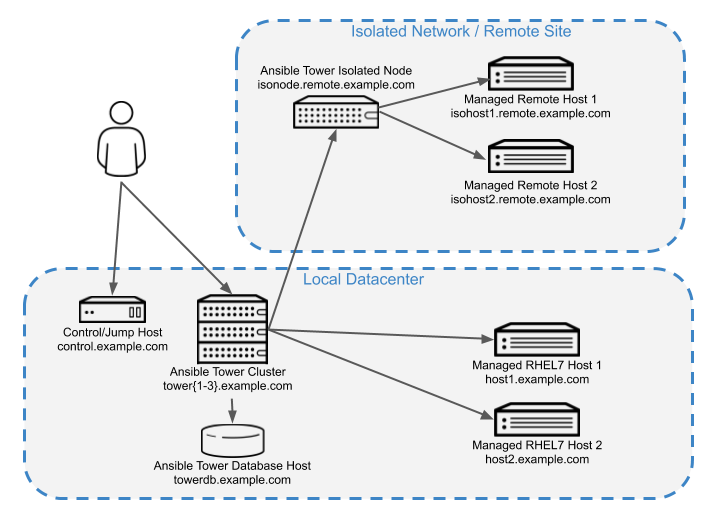

# Exercise 1 - Ansible Tower Advanced

## About this Lab

You have already used Ansible Automation quite a bit and have started to
look into Tower? Or you are already using Tower? Cool. We prepared this
lab to give a hands-on introduction to some of the more advanced
features of Tower. You’ll learn about:

  - Using command line tools to manage Ansible Tower

  - Ansible Tower clustering

  - Working with Instance Groups

  - Using isolated nodes to manage remote locations

  - Ways to provide inventories (importing inventory, dynamic inventory)

  - The Smart Inventory feature

  - Optional: How to structure Ansible content in Git repos

  - Optional: How to work with the Tower API

## So little time and so much to do…

> **Warning**
>
> To be honest we got carried away slightly while trying to press all
> these cool features into a two-hours lab session. We decided to flag
> the last two chapters as "optional" instead of taking them out. If you
> find the time to run them, cool\! If not, the lab guide will stay
> where it is, feel free to go through these lab tasks later (you don’t
> need a Tower cluster for this).

## Want to Use this Lab after Summit?

Definitely, the Asciidoc sources are available here:

**https://github.com/goetzrieger/ansible-labs/blob/master/tower/ansible\_tower\_advanced.adoc**

# Your Ansible Tower Lab Environment

In this lab you work in a pre-configured lab environment. You will have
access to the following hosts:

|                                  |                                         |                                |
| -------------------------------- | --------------------------------------- | ------------------------------ |
| Role                             | Hostname External (if applicable)       | Hostname Internal              |
| Control/Bastion Host, Gitea Repo | bastion.&lt;GUID&gt;.sandbox951.opentlc.com | bastion.&lt;GUID&gt;.internal      |
| Ansible Tower Cluster            |                                         |                                |
| Ansible Tower Load Balancer      | tower.&lt;GUID&gt;.sandbox951.opentlc.com   |                                |
| Ansible Tower Database Host      |                                         | towerdb.example.com            |
| Managed RHEL7 Host 1             |                                         | support1.&lt;GUID&gt;.internal     |
| Managed RHEL7 Host 2             |                                         | support1.&lt;GUID&gt;.internal     |
| Ansible Tower Isolated Node      |                                         | worker1.emea.&lt;GUID&gt;.internal |
| Managed Remote Host 1            |                                         | isosupport1.&lt;GUID&gt;.internal  |
| Managed Remote Host 2            |                                         | isosupport2.&lt;GUID&gt;.internal  |

> **Tip**
>
> Your lab environment will get a unique **&lt;GUID&gt;**. You will be able
> to SSH into the bastion host using the external hostname
> `bastion.<GUID>.sandbox951.opentlc.com`, from here you need to SSH
> into the other hosts to run tasks on the commandline.

> **Tip**
>
> Ansible Tower has already been installed and licensed for you, the web
> UI will be reachable over HTTP/HTTPS.

As you can see the lab environment is pretty extensive. You basically
have one network segment with:

  - A bastion/control host you access via SSH, the Gitea git repo lives
    here as well

  - A three-node Tower cluster with a separate DB host, accessed via SSH
    (from control host) or web UI

  - Two managed RHEL 7 hosts

And a second network segment with:

  - One host that acts as an isolated Tower node that can be reached via
    SSH from the Tower cluster nodes.

  - Two hosts which act as remote managed nodes that can only be reached
    from/through the isolated node.

A diagram says more then a thousand words:

> **Tip**
>
> Access to the isolated node and the managed hosts is actually not
> restricted in the lab environment. Just imagine filtered, DMZ-like
> access rules for educational purposes… ;-)

## Working the Lab

Some hints to get you started:

  - Don’t type everything manually, use copy & paste from the browser
    when appropriate. But don’t stop to think and understand… ;-)

  - All labs where prepared using **Vim**, but we understand not
    everybody loves it. Feel free to use alternative editors, in the lab
    environment we provide **Midnight Commander** (just run **mc**,
    function keys can be reached via Esc-&lt;n&gt; or simply clicked with
    the mouse) or **Nano** (run **nano**). Here is a short [editor
    intro,
    window="\_blank"](http://people.redhat.com/grieger/editor_intro_rhel7.html).

> **Tip**
>
> Commands you are supposed to run are shown with or without the
> expected output, whatever makes more sense in the context.

> **Tip**
>
> The command line can wrap on the HTML page from time to time. Therefor
> the output is often separated from the command line for better
> readability by an empty line. **Anyway, the line you should actually
> run should be recognizable by the prompt.** :-)
