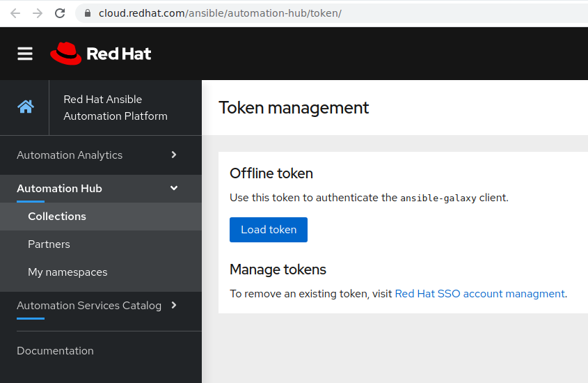
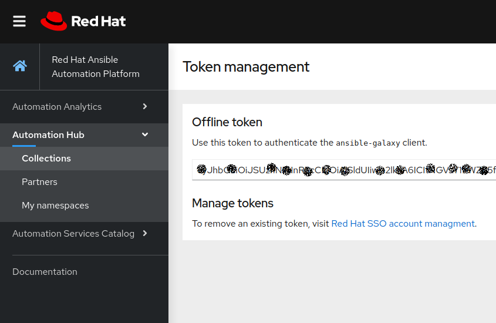

+++
title = "Information: Accessing Collections"
weight = 6
+++

This is not an exercise you can actually run in this environment because you would need to have an account to Ansible Automation Hub that comes with a subscription of Ansible Automation Platform. It is here for your information.

## Accessing collections

Ansible collections can be used and downloaded from multiple locations. They can either be downloaded using a requirement file, statically included in the git repository or eventually installed separately in the virtual environment.

In the scope of this exercise, the focus is on how access content from Automation Hub. This requires an authentication token and authentication URL. To do, some configuration steps need to be done in Ansible Tower.

## Authenticate Tower to Automation Hub

### Creating a token

Authenticating Ansible Tower requires a token. It can be achieved using the steps below:

1. Navigate to [https://cloud.redhat.com/ansible/automation-hub/token/](https://cloud.redhat.com/ansible/automation-hub/token/)

   

1. Click **Load Token**.

1. Click **copy icon** to copy the API token to the clipboard.

   

### Using authentication token

1. As user admin, navigate to the *Settings l> Jobs*

1. Set **PRIMARY GALAXY SERVER URL** to `https://cloud.redhat.com/api/automation-hub/`

1. Set **PRIMARY GALAXY AUTHENTICATION** URL to `https://sso.redhat.com/auth/realms/redhat-external/protocol/openid-connect/token`

1. Set **PRIMARY GALAXY SERVER TOKEN** to <COPIED_TOKEN>

{}
It is recommended using Red Hat Automation Hub as primary Galaxy Server URL to ensure using certified and supported content by Red Hat and its partners via Red Hat Ansible Automation subscription.
{}

  

### Using collections

After authenticating Ansible Tower to access Automation Hub, using `collections/requirements.yml` file will automatically fetches the content collections from Automation Hub as first source.

## Takeaways

- The Red Hat Automation Hub provides certified collections that supported by Red Hat and its Partners. It's available via Red Hat Ansible Automation Platform.
- Ansible Galaxy hosts upstream community content collections.
- Red Hat Ansible Tower can be configured to authenticate to Red Hat Automation Hub in order to fetch certified and supported content collections that are utilized in a given project within tower.

----
**Navigation**
 
[Previous Exercise](../5-creating-collections/) - [Next Exercise](../7-advanced-inventory-collections/)

[Click here to return to the Ansible for Red Hat Enterprise Linux Workshop](../README.md)
